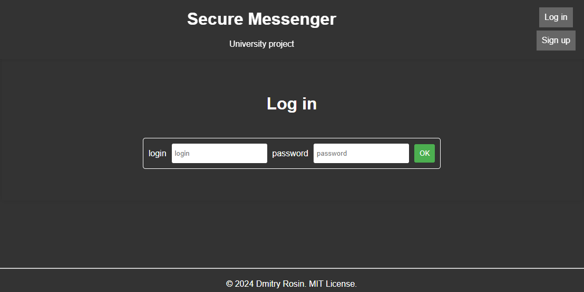
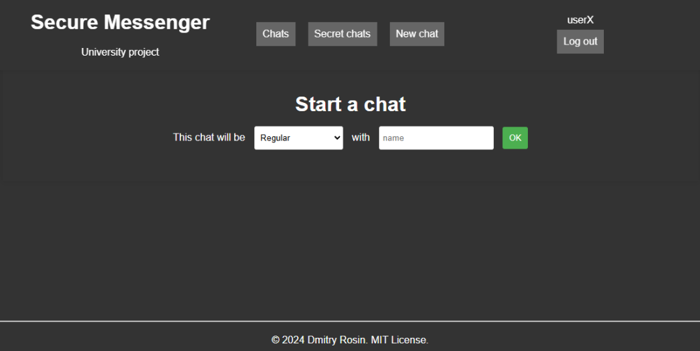
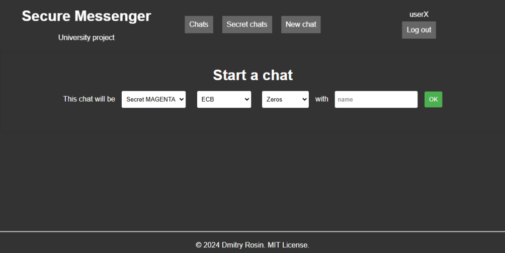
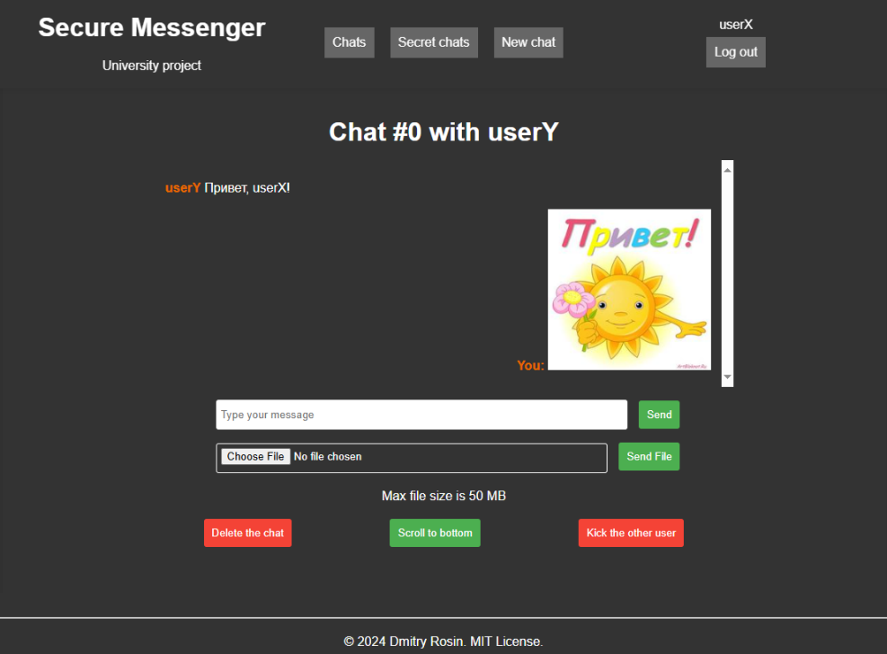
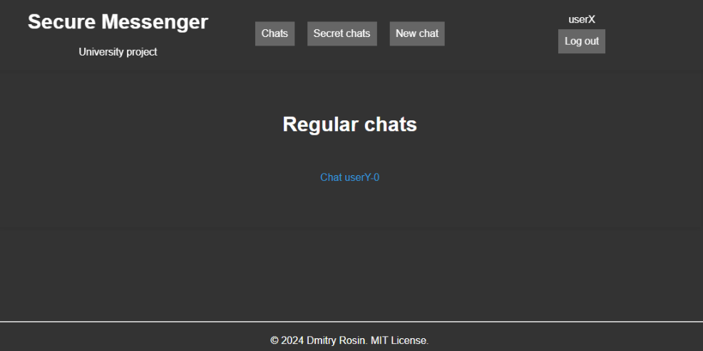
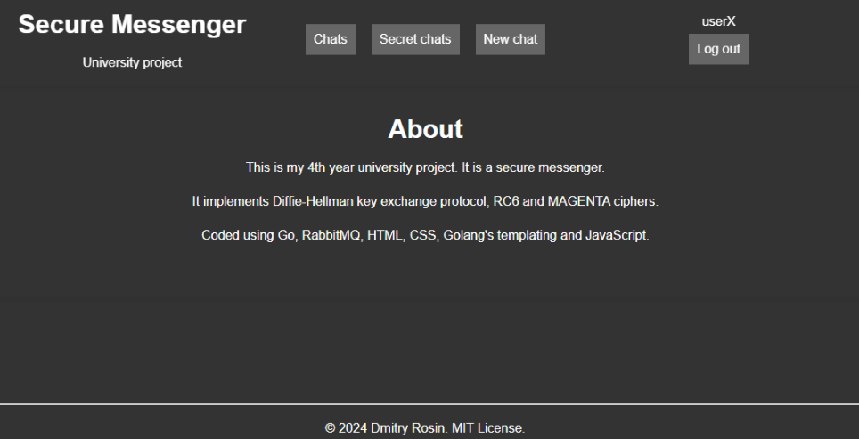
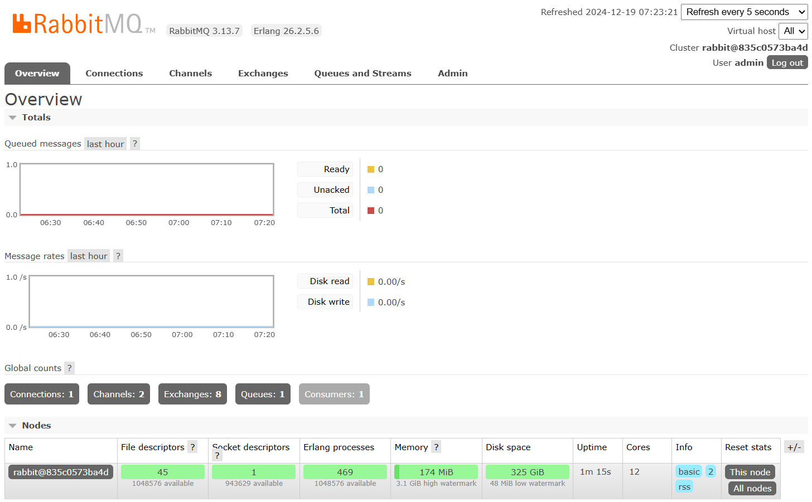

# SecureMessenger
 

# Русский
[Jump to English](#English)

Содержание

- [О проекте](#RuAbout)
- [Техническое задание](#RuSpecs)
- [Демонстрация работы](#RuDemo)
- [Установка, запуск, удаление](#RuRun)

SecureMessenger - университетский курсовой проект с 4 курса по предмету "Защита информации", который представляет из себя защищенный мессенджер с имплементацией следующих технологий:
- алгоритмы шифрования RC6 и MAGENTA
- режимы шифрования ECB, CBC, PCBC, CFB, OFB, CTR
- режимы набивки Zeros, ANSI X.923, PKCS7 и ISO 10126
- протокол Диффи-Хеллмана

### Техническое задание

 1. Реализовать два симметричных алгоритма шифрования, реализующих интерфейс симметричного алгоритма шифрования (использование сторонних реализаций алгоритмов не  допускается).

 2. Реализовать протокол Диффи-Хеллмана (использование сторонних реализаций протокола не допускается).

 3. Реализовать консольное серверное приложение, взаимодействие с которым возможно при помощи сетевого протокола и надстроек над ним (REST API, gRPC, WCF, etc.), API которого предусматривает возможность выполнения следующих протоколов (протокол может быть организован посредством выполнения нескольких связанных запросов):
    - Создание “комнаты” для организации защищённого обмена сообщениями между двумя клиентами (секретный чат) с возможностью выбора используемого алгоритма шифрования из реализованных в п. 1;
    - Закрытие ранее созданного секретного чата;
    - Подключение и отключение клиентов от секретного чата;
    - Организация распределения сеансового ключа сгенерированного посредством протокола Диффи-Хеллмана;
    - Обработка пользовательских запросов на приём и передачу данных между клиентами, участвующими в защищённом обмене сообщениями.

    Передача сообщений должна быть реализована в асинхронном стиле с использованием технологий потоковой передачи данных (Вы можете использовать gRPC Streaming, Redpanda, Apache Kafka, Apache ActiveMQ Artemis, RabbitMQ, MSMQ, Apache Spark, Apache Flink и т. д.). Сообщениями должны являться фрагменты шифротекста. После передачи зашифрованного фрагмента сообщения клиенту-потребителю запрещено дальнейшее контролируемое хранение этого фрагмента. Формат сериализации сообщений продумайте самостоятельно. Необходимо предусмотреть возможность развёртывания инфраструктуры серверной части (серверное приложение + streaming) в Docker.

    *Опционально*: реализовать этап развёртывания серверного приложения на основе абстракции инверсии управления (IoC), реализованной в виде механизма внедрения зависимости (DI). Конфигурирование этапа развёртывания обеспечьте при помощи конфигурационных файлов и их трансформаций.

    *Опционально*: обеспечить возможность репликации хранящихся в брокере сообщений данных.

4. Реализовать приложение (оконное или web), позволяющее:
    - Инициировать выполнение протокола на создание секретного чата с указанием используемого симметричного алгоритма шифрования;
    - Инициировать выполнение протокола на подключение к ранее созданному секретному чату;
    - Инициировать выполнение протокола на отключение от секретного чата, к которому в данный момент существует подключение;
    - Генерировать вектор инициализации (IV) для его применения в режимах шифрования: CBC, PCBC, CFB, OFB, CTR, Random Delta;
    - Организовать функционал для выбора данных, подвергаемых шифрованию и передаче второй стороне, участвующей в секретном чате:
        - ввод текста в текстовое поле
        - выбор файла с данными при помощи стандартного диалога выбора файла
    - Многопоточно (по возможности) шифровать данные сеансовым ключом симметричного алгоритма (с использованием одного из режимов шифрования: ECB, CBC, PCBC, CFB, OFB, CTR, Random Delta; также с использованием режима набивки: Zeros, ANSI X.923, PKCS7, ISO 10126);
    - Инициировать выполнение протокола передачи вычисленного шифротекста на сторону серверного приложения при помощи нажатия кнопки на UI;
    - Инициировать выполнение протокола получения шифротекста со стороны серверного приложения в фоновом режиме;
    - Многопоточно (по возможности) дешифровать полученный шифротекст распределённым между сторонами сеансовым ключом симметричного алгоритма (с учётом режима шифрования и режима набивки, применённых при операции шифрования);
    - Отображать список активных секретных чатов текущего пользователя;
    - Отображать переданные и полученные сообщения в надлежащем виде (текст как текст, картинки как картинки, остальные файлы- как компоненты UI, позволяющие сохранить файлы на локальное устройство при помощи стандартного диалога сохранения файла;
    - Сохранять переданные и полученные сообщения в локальной СУБД, устройство и взаимодействие с которой определите самостоятельно;
    - Отображать прогресс операций шифрования / дешифрования / передачи данных / получения данных при помощи элементов управления типа ProgressBar;
    - Инициировать отмену операции шифрования / дешифрования / передачи данных / получения данных по запросу пользователя;
    - Инициировать выполнение протокола на отключение одного или обоих клиентов от секретного чата.

 Приложение должно иметь интуитивно понятный и удобный пользовательский интерфейс.

 Поведение клиентского приложения, приводящее к аварийной ситуации, не допускается.

 ### Демонстрация работы

 - Перед входом необходимо зарегистрироваться. Система автоматически регистрирует пользователя, если он выбрал уникальный юзернейм.

 - В дропдауне можно выбрать разные типы чатов: обычный, секретный с алгоритмом RC6, секретный с алгоритмом MAGENTA.

 - В секретном чате также необходимо указать режим шифрования и режим набивки.

 - В чате можно прикреплять файлы (в том числе картинки) и текстовые сообщения. Каждый файл и текстовое сообщение имеют уникальный message ID. Отправить текст и файл в одном сообщении нельзя.
 - Чат можно удалить для обоих пользователей или только для вашего собеседника.
 - Присутствует кнопка прокрутки истории сообщений в самый низ для удобства пользователей.

 - После создания чата его ID отражается в списке чатов. Секретные чаты отражаются, соответственно, в списке секретных чатов. ID секретных чатов начинаются с буквы S.

 - На странице About собрана краткая информация о приложении.

 - На странице серверного интерфейса можно отслеживать только факт создания чатов между пользователями и отправку сообщений между ними. Шифрование имеет сквозной характер.
 - По желанию админ может удалить чат, удалить пользователей и отключить приложение, однако вмешаться в переписку он не может.

 ### Установка, запуск, удаление

 - Из директории `infrastructure` запустите команду `docker compose up --build`.
 
Про флаг «--build»

Флаг «--build» гарантирует, что контейнеры будут подняты в соответствие с последней установленной версией сервиса, в противном случае может быть использован образ ранее установленной более старой версии

 - После запуска командой, по истечению примерно 30 секунд (значение по умолчанию, на слабых системах может быть больше), сервис начнет свою работу.
 - По умолчанию панель администрирования брокера сообщений RabbitMQ находится по адресу `http://localhost:15672/`, а пользовательский интерфейс клиентской части доступен по адресу `http://localhost:8080/`. Изменить порты этих страниц можно в конфигурационном файле `docker-compose.yml`, который находится в директории `infrastructure`.
 - Завершается работа сервиса нажатием сочетания клавиш `Ctrl+C` в терминале, в котором он был начат, либо любой другой штатной остановкой работы контейнера.
 - Для полной его остановки с удалением всех накопленных данных и информации о существующих чатах требуется ввести команду `docker compose down` из директории `infrastructure`.
 - Для полного удаления сервиса достаточно полностью остановить его работу, а затем просто удалить директорию сервиса, все данные хранятся локально в docker контейнере и директории сервиса.

# English
[Перейти к русскому](#Russian)

Contents

- [About](#EnAbout)
- [Specifications](#EnSpecs)
- [Work demonstration](#EnDemo)
- [Installation, launch, removal](#EnRun)

### About
SecureMessenger is a university course project from the 4th year on the subject "Information Security", which is a secure messenger with the implementation of the following technologies:
- encryption algorithms RC6 and MAGENTA
- encryption modes ECB, CBC, PCBC, CFB, OFB, CTR
- padding modes Zeros, ANSI X.923, PKCS7 and ISO 10126
- Diffie-Hellman protocol

### Specifications

1. Implement two symmetric encryption algorithms implementing the symmetric encryption algorithm interface (use of third-party implementations of the algorithms is not allowed).

2. Implement the Diffie-Hellman protocol (use of third-party implementations of the protocol is not allowed).

3. Implement a console server application, interaction with which is possible using a network protocol and add-ons above it (REST API, gRPC, WCF, etc.), the API of which provides the ability to execute the following protocols (the protocol can be organized by executing several related requests):
- Creating a “room” for organizing secure messaging between two clients (secret chat) with the ability to select the encryption algorithm used from those implemented in paragraph 1;
- Closing a previously created secret chat;
- Connecting and disconnecting clients from a secret chat;
- Organizing the distribution of a session key generated using the Diffie-Hellman protocol;
- Processing user requests for receiving and transmitting data between clients participating in secure messaging.

Message transmission should be implemented in an asynchronous style using streaming data technologies (you can use gRPC Streaming, Redpanda, Apache Kafka, Apache ActiveMQ Artemis, RabbitMQ, MSMQ, Apache Spark, Apache Flink, etc.). Messages should be fragments of ciphertext. After the encrypted fragment of the message is transmitted to the client-consumer, further controlled storage of this fragment is prohibited. Think over the message serialization format yourself. It is necessary to provide the ability to deploy the server-side infrastructure (server application + streaming) in Docker.

*Optional*: implement the deployment stage of the server application based on the inversion of control (IoC) abstraction, implemented as a dependency injection (DI) mechanism. Configure the deployment stage using configuration files and their transformations.

*Optional*: provide the ability to replicate data messages stored in the broker.

4. Implement an application (window or web) that allows:
- Initiate execution of the protocol for creating a secret chat, specifying the symmetric encryption algorithm used;
- Initiate execution of the protocol for connecting to a previously created secret chat;
- Initiate execution of the protocol for disconnecting from a secret chat to which a connection currently exists;
- Generate an initialization vector (IV) for its use in encryption modes: CBC, PCBC, CFB, OFB, CTR, Random Delta;
- Organize functionality for selecting data to be encrypted and transmitted to the second party participating in a secret chat:
    - entering text in a text field
    - selecting a file with data using a standard file selection dialog
- Multithreaded (if possible) encryption of data with a session key of a symmetric algorithm (using one of the encryption modes: ECB, CBC, PCBC, CFB, OFB, CTR, Random Delta; also using the padding mode: Zeros, ANSI X.923, PKCS7, ISO 10126);
- Initiate execution of the protocol for transmitting the calculated ciphertext to the server application by pressing a button on the UI;
- Initiate execution of the protocol for receiving the ciphertext from the server application in the background;
- Multithreaded (if possible) decrypt the received ciphertext with a session key of a symmetric algorithm distributed between the parties (taking into account the encryption mode and padding mode applied during the encryption operation);
- Display a list of active secret chats of the current user;
- Display transmitted and received messages in the proper form (text as text, images as images, other files as UI components that allow saving files to a local device using the standard file save dialog);
- Save transmitted and received messages in a local DBMS, the device and interaction with which you define yourself;
- Display the progress of encryption / decryption / data transfer / data receipt operations using ProgressBar type controls;
- Initiate the cancellation of the encryption / decryption / data transfer / data receipt operation upon user request;
- Initiate the execution of the protocol to disconnect one or both clients from the secret chat.

The application must have an intuitive and convenient user interface.

The behavior of the client application that leads to an emergency situation is not allowed.

### Work demonstration

- Before logging in, you must register. The system automatically registers the user if he has chosen a unique username.

- In the dropdown, you can choose different types of chats: normal, secret with the RC6 algorithm, secret with the MAGENTA algorithm.

- In a secret chat, you also need to specify the encryption mode and the padding mode.

- You can attach files (including pictures) and text messages to the chat. Each file and text message has a unique message ID. You cannot send text and a file in one message.
- You can delete the chat for both users or only for your interlocutor.
- There is a button to scroll the message history to the very bottom for the convenience of users.

- After creating a chat, its ID is displayed in the chats list. Secret chats are displayed in the secret chats list. Secret chats IDs start with the letter S.

- The About page contains brief information about the application.

- The server interface page can only track the fact of creating chats between users and sending messages between them. Encryption is end-to-end.
- An admin can delete a chat, remove users and disable the application if desired, but he cannot interfere with the correspondence.

### Installation, launch, removal

- From the `infrastructure` directory, run the `docker compose up --build` command.
 
About the "--build" flag

The "--build" flag ensures that the containers will be raised in accordance with the latest installed version of the service, otherwise an image of a previously installed older version may be used

- After launching the command, after about 30 seconds (the default value, on weak systems it may be longer), the service will start its work.
- By default, the RabbitMQ message broker administration panel is located at `http://localhost:15672/`, and the client-side user interface is available at `http://localhost:8080/`. You can change the ports of these pages in the `docker-compose.yml` configuration file, which is located in the `infrastructure` directory.
- The service is terminated by pressing the `Ctrl+C` key combination in the terminal in which it was started, or by any other regular stop of the container.
- To completely stop it with the deletion of all accumulated data and information about existing chats, you must enter the `docker compose down` command from the `infrastructure` directory.
- To completely remove the service, it is enough to completely stop its operation, and then simply delete the service directory, all data is stored locally in the docker container and the service directory.